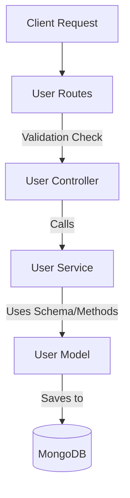
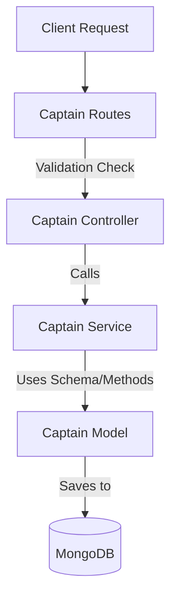

# Uber Clone Backend - User Authentication API

This documentation describes the user registration and authentication flow in the Uber Clone backend application, detailing the roles of the models, services, controllers, routes, and API endpoints.

---

## Architecture Overview

The backend uses a standard controller-service-repository (model) architectural pattern:



---

## 1. User Model (`models/user.model.js`)

Defines the database schema for the `user` collection in MongoDB along with document methods and static helper functions.

### Schema Fields
- **`fullname`** (Object, Required):
  - **`firstname`** (String, Required): Minimum 3 characters.
  - **`lastname`** (String, Optional): Minimum 3 characters.
- **`email`** (String, Required, Unique): User's email address.
- **`password`** (String, Required): Hashed password (hidden by default in queries using `select: false`).
- **`socketId`** (String, Optional): Socket identifier for real-time features.

### Methods & Statics
- **`generateAuthToken()`** (Instance Method): Generates a JWT token signed with the user's `_id` and the `JWT_SECRET` environment variable.
- **`comparePasword(password)`** (Instance Method): Asynchronously compares a plain-text password with the stored hash using `bcrypt`.
- **`hashPassword(password)`** (Static Method): Hashes a plain-text password with a salt round of 10.

### Captain Model (`models/captain.model.js`)

Defines the database schema for the `captain` (driver) collection in MongoDB along with document methods and static helper functions.

### Schema Fields
- **`fullname`** (Object, Required):
  - **`firstname`** (String, Required): Minimum 3 characters.
  - **`lastname`** (String, Optional): Minimum 3 characters.
- **`email`** (String, Required, Unique): Captain's email address.
- **`password`** (String, Required): Hashed password (hidden by default in queries using `select: false`).
- **`socketId`** (String, Optional): Socket identifier for real-time features.
- **`status`** (String, Optional): Status of the captain (`active` or `inactive`, default: `inactive`).
- **`vehicle`** (Object, Required):
  - **`color`** (String, Required): Minimum 3 characters.
  - **`plate`** (String, Required): Minimum 3 characters.
  - **`capacity`** (Number, Required): Minimum 1 capacity.
  - **`vehicleType`** (String, Required): Must be one of `car`, `auto`, or `bike`.
  - **`location`** (Object, Optional): Coordinates containing `lat` (latitude) and `long` (longitude).

### Methods & Statics
- **`generateAuthToken()`** (Instance Method): Generates a JWT token signed with the captain's `_id` and the `JWT_SECRET` environment variable (expires in 24h).
- **`comparePasword(password)`** (Instance Method): Asynchronously compares a plain-text password with the stored hash using `bcrypt`.
- **`hashPassword(password)`** (Static Method): Hashes a plain-text password with a salt round of 10.

---

## 2. User Service (`services/user.service.js`)

Contains pure business logic and handles database operations.

### `createUser({ firstname, lastname, email, password })`
- Validates that `firstname`, `email`, and `password` are present.
- Creates a new user document in MongoDB.
- Returns the created `user` document.

### Captain Service (`services/captain.service.js`)

### `createCaptain({ firstname, lastname, email, password, color, plate, capacity, vehicleType })`
- Validates that all fields (`firstname`, `email`, `password`, `color`, `plate`, `capacity`, `vehicleType`) are present.
- Creates a new captain document in MongoDB.
- Returns the created `captain` document.

---

## 3. User Controller (`controllers/user.controller.js`)

Manages incoming requests, extracts inputs, orchestrates validation, calls services, and sends responses.

### `registerUser(req, res, next)`
- Inspects validation results from `express-validator`.
- Destructures `fullname`, `email`, and `password` from the request body.
- Hashes the password by calling `userModel.hashPassword(password)`.
- Calls `userService.createUser(...)` to save the user.
- Generates a JWT by calling `user.generateAuthToken()`.
- Sends back the status code and JSON payload.

### `logOut(req, res)`
- Clears the authentication token cookie.
- Adds the token to the `Blacklist` token database collection to invalidate it.
- Sends back a success JSON response.

### Captain Controller (`controllers/captain.controller.js`)

### `registerCaptain(req, res, next)`
- Inspects validation results from `express-validator`.
- Destructures `fullname`, `email`, `password`, and `vehicle` from the request body.
- Hashes the password by calling `captainModel.hashPassword(password)`.
- Calls the service `createCaptain(...)` to save the captain.
- Generates a JWT by calling `captain.generateAuthToken()`.
- Sends back the status code `201 Created` along with the JWT and captain details.

### `loginCaptain(req, res, next)`
- Inspects validation results from `express-validator`.
- Destructures `email` and `password` from the request body.
- Queries the database for the captain with the given email (selecting the password field).
- Verifies the password using `comparePasword(password)`.
- Generates a JWT token using `captain.generateAuthToken()`.
- Sets the cookie `token` and returns the token and captain object with status code `200 OK`.

### `getCaptainProfile(req, res, next)`
- Returns the authenticated captain's profile data stored in `req.captain`.

### `logOutCaptain(req, res)`
- Clears the authentication token cookie.
- Adds the token to the `Blacklist` token database collection to invalidate it.
- Sends back a success JSON response.

---

## 4. User Routes (`routes/user.routes.js`)

Maps URL endpoints to controller methods and enforces validation rules.

### Route definition: `POST /users/register`
- **Validation Rules**:
  - `email` must be a valid email format.
  - `fullname.firstname` must be at least 3 characters.
  - `password` must be at least 6 characters.

### Route definition: `POST /users/login`
- **Validation Rules**:
  - `email` must be a valid email format.
  - `password` must be at least 6 characters.

### Route definition: `GET /users/logout`
- **Validation Rules**: Requires authentication via Bearer token or cookie.

### Captain Routes (`routes/captain.routes.js`)

### Route definition: `POST /captains/register`
- **Validation Rules**:
  - `email` must be a valid email format.
  - `fullname.firstname` must be at least 3 characters.
  - `password` must be at least 6 characters.
  - `vehicle.color` must be at least 3 characters.
  - `vehicle.plate` must be at least 3 characters.
  - `vehicle.capacity` must be an integer and at least 1.
  - `vehicle.vehicleType` must be one of `['car', 'auto', 'bike']`.

### Route definition: `POST /captains/login`
- **Validation Rules**:
  - `email` must be a valid email format.
  - `password` must be at least 6 characters.

### Route definition: `GET /captains/profile`
- **Validation Rules**: Requires authentication via Bearer token or cookie.

### Route definition: `GET /captains/logout`
- **Validation Rules**: Requires authentication via Bearer token or cookie.

---

## 5. API Endpoint Details & Data Flow

### User Data Flow Diagram & Explanation


- **Data Flow Explanation**: 
  - The Client sends a request to the user routes.
  - The request passes through input validation.
  - The user controller extracts the validated payload and calls the user service.
  - The user service invokes Mongoose model methods to write or query from MongoDB.
  - The controller signs a JWT token and returns the session payload to the Client.

### Captain Data Flow Diagram & Explanation



- **Data Flow Explanation**: 
  - The Client sends a request to the captain routes (e.g. register, login, profile, or logout).
  - Validation middleware verifies both personal driver fields and vehicle parameters (`color`, `plate`, `capacity`, `vehicleType`).
  - The captain controller parses the input, hashes the credentials, and coordinates with the captain service.
  - The captain service persists the driver status (defaulting to `inactive`) and vehicle info to MongoDB.
  - A JWT token is generated on successful authentication, and the session is returned back to the Client.

---

### How Data is Obtained & Processed between Endpoints

#### For Users:
1. **Request Reception**: The client sends a request (e.g., `POST /users/register` or `POST /users/login`) with a JSON payload containing user fields.
2. **Payload Extraction & Validation**: The validation middleware enforces email structure, name length, and password rules. If valid, the controller destructures `fullname` (`firstname`, `lastname`), `email`, and `password` from `req.body`.
3. **Database & Business Logic**: The controller hashes the password and invokes the user service to create a document in the database. For login, it queries the database and verifies the password hash.
4. **Token Generation & Response**: A JWT token is generated by the user model method (`generateAuthToken()`). The controller sets the authentication cookie, then responds with `201 Created` or `200 OK` along with the token and user data.

#### For Captains:
1. **Request Reception**: The client sends a request (e.g., `POST /captains/register` or `POST /captains/login`) with a JSON payload containing captain and vehicle details.
2. **Payload Extraction & Validation**: Validation middleware verifies driver and vehicle fields. The controller destructures `fullname` (`firstname`, `lastname`), `email`, `password`, and `vehicle` (`color`, `plate`, `capacity`, `vehicleType`).
3. **Database & Business Logic**: The controller hashes the password and invokes the captain service to save the captain and vehicle details into MongoDB. For login, it queries the captain collection and verifies the credentials using `comparePasword`.
4. **Token Generation & Response**: A JWT token is generated by the captain model method (`generateAuthToken()`). The controller sets the token cookie and returns status `201 Created` or `200 OK` along with the token and captain object.
5. **Session/Logout Processing**: For logout, the `authCaptain` middleware verifies the token is not blacklisted. The controller clears the client cookie, extracts the token, and writes it to the `BlacklistToken` collection in MongoDB to invalidate it.

---

### Registration Request Format (`POST /users/register`)
- **Body**:
  ```json
  {
    "fullname": {
      "firstname": "John",
      "lastname": "Doe"
    },
    "email": "john.doe@example.com",
    "password": "securePassword123"
  }
  ```
- **Response (201 Created)**:
  ```json
  {
    "token": "eyJhbGciOiJIUzI1NiIsInR5cCI6IkpXVCJ9...",
    "user": {
      "fullname": {
        "firstname": "John",
        "lastname": "Doe"
      },
      "email": "john.doe@example.com",
      "password": "$2b$10$...",
      "_id": "6a31856e58cd92928c5211ad",
      "__v": 0
    }
  }
  ```

### Login Request Format (`POST /users/login`)
- **Body**:
  ```json
  {
    "email": "john.doe@example.com",
    "password": "securePassword123"
  }
  ```
- **Response (200 OK)**:
  ```json
  {
    "token": "eyJhbGciOiJIUzI1NiIsInR5cCI6IkpXVCJ9...",
    "user": {
      "fullname": {
        "firstname": "John",
        "lastname": "Doe"
      },
      "email": "john.doe@example.com",
      "_id": "6a31856e58cd92928c5211ad",
      "__v": 0
    }
  }
  ```

### Logout Request Format (`GET /users/logout`)
- **Headers**:
  ```
  Authorization: Bearer <token>
  ```
- **Response (200 OK)**:
  ```json
  {
    "message": "Logged out successfully"
  }
  ```

### Captain Registration Request Format (`POST /captains/register`)
- **Body**:
  ```json
  {
    "fullname": {
      "firstname": "Captain",
      "lastname": "Jack"
    },
    "email": "captain.jack.789@example.com",
    "password": "securepassword123",
    "vehicle": {
      "color": "black",
      "plate": "KA-01-1234",
      "capacity": 4,
      "vehicleType": "car"
    }
  }
  ```
- **Response (201 Created)**:
  ```json
  {
    "token": "eyJhbGciOiJIUzI1NiIsInR5cCI6IkpXVCJ9...",
    "captain": {
      "fullname": {
        "firstname": "Captain",
        "lastname": "Jack"
      },
      "email": "captain.jack.789@example.com",
      "status": "inactive",
      "vehicle": {
        "color": "black",
        "plate": "KA-01-1234",
        "capacity": 4,
        "vehicleType": "car"
      },
      "_id": "6a32e3d0a5bdec1f035ca288",
      "__v": 0
    }
  }
  ```

### Captain Login Request Format (`POST /captains/login`)
- **Body**:
  ```json
  {
    "email": "captain.jack.789@example.com",
    "password": "securepassword123"
  }
  ```
- **Response (200 OK)**:
  ```json
  {
    "token": "eyJhbGciOiJIUzI1NiIsInR5cCI6IkpXVCJ9...",
    "captain": {
      "fullname": {
        "firstname": "Captain",
        "lastname": "Jack"
      },
      "email": "captain.jack.789@example.com",
      "status": "inactive",
      "vehicle": {
        "color": "black",
        "plate": "KA-01-1234",
        "capacity": 4,
        "vehicleType": "car"
      },
      "_id": "6a32e3d0a5bdec1f035ca288",
      "__v": 0
    }
  }
  ```

### Captain Profile Request Format (`GET /captains/profile`)
- **Headers**:
  ```
  Authorization: Bearer <token>
  ```
- **Response (200 OK)**:
  ```json
  {
    "fullname": {
      "firstname": "Captain",
      "lastname": "Jack"
    },
    "email": "captain.jack.789@example.com",
    "status": "inactive",
    "vehicle": {
      "color": "black",
      "plate": "KA-01-1234",
      "capacity": 4,
      "vehicleType": "car"
    },
    "_id": "6a32e3d0a5bdec1f035ca288",
    "__v": 0
  }
  ```

### Captain Logout Request Format (`GET /captains/logout`)
- **Headers**:
  ```
  Authorization: Bearer <token>
  ```
- **Response (200 OK)**:
  ```json
  {
    "message": "Logged out successfully"
  }
  ```

---

## 6. HTTP Status Codes

The authentication endpoints return the following status codes:

| Status Code | Status Text | Description |
| :--- | :--- | :--- |
| **`200`** | `OK` | Login was successful. The token and user information are returned in the response. |
| **`201`** | `Created` | The user registration was successful. The token and user information are returned in the response. |
| **`400`** | `Bad Request` | Validation failed (e.g., email invalid, password too short, or name missing). A list of errors is returned. |
| **`401`** | `Unauthorized` | Invalid email or password during login. |
| **`500`** | `Internal Server Error` | An unexpected server error occurred (e.g., database connection issues). |
