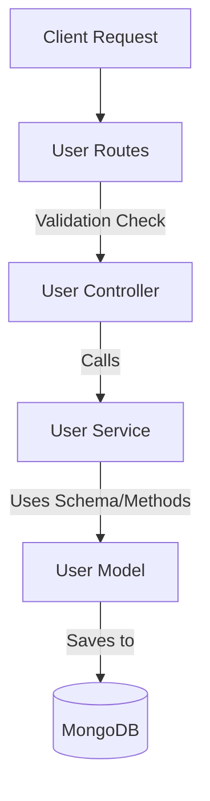

# Uber Clone Backend - User Authentication API

This documentation describes the user registration and authentication flow in the Uber Clone backend application, detailing the roles of the models, services, controllers, routes, and API endpoints.

---

## Architecture Overview

The backend uses a standard controller-service-repository (model) architectural pattern:



---

## 1. User Model (`models/user.model.js`)

Defines the database schema for the `user` collection in MongoDB along with document methods and static helper functions.

### Schema Fields
- **`fullname`** (Object, Required):
  - **`firstname`** (String, Required): Minimum 3 characters.
  - **`lastname`** (String, Optional): Minimum 3 characters.
- **`email`** (String, Required, Unique): User's email address.
- **`password`** (String, Required): Hashed password (hidden by default in queries using `select: false`).
- **`socketId`** (String, Optional): Socket identifier for real-time features.

### Methods & Statics
- **`generateAuthToken()`** (Instance Method): Generates a JWT token signed with the user's `_id` and the `JWT_SECRET` environment variable.
- **`comparePasword(password)`** (Instance Method): Asynchronously compares a plain-text password with the stored hash using `bcrypt`.
- **`hashPassword(password)`** (Static Method): Hashes a plain-text password with a salt round of 10.

---

## 2. User Service (`services/user.service.js`)

Contains pure business logic and handles database operations.

### `createUser({ firstname, lastname, email, password })`
- Validates that `firstname`, `email`, and `password` are present.
- Creates a new user document in MongoDB.
- Returns the created `user` document.

---

## 3. User Controller (`controllers/user.controller.js`)

Manages incoming requests, extracts inputs, orchestrates validation, calls services, and sends responses.

### `registerUser(req, res, next)`
- Inspects validation results from `express-validator`.
- Destructures `fullname`, `email`, and `password` from the request body.
- Hashes the password by calling `userModel.hashPassword(password)`.
- Calls `userService.createUser(...)` to save the user.
- Generates a JWT by calling `user.generateAuthToken()`.
- Sends back the status code and JSON payload.

---

## 4. User Routes (`routes/user.routes.js`)

Maps URL endpoints to controller methods and enforces validation rules.

### Route definition: `POST /users/register`
- **Validation Rules**:
  - `email` must be a valid email format.
  - `fullname.firstname` must be at least 3 characters.
  - `password` must be at least 6 characters.

---

## 5. API Endpoint Details & Data Flow

### How Data is Obtained from the Endpoints

1. **Request Reception**: The client sends a `POST` request to `http://localhost:6000/users/register` with a JSON body.
2. **Payload Extraction**: The application reads properties from `req.body.fullname` (`firstname`, `lastname`), `req.body.email`, and `req.body.password`.
3. **Response Delivery**: If successful, the API returns a JSON payload containing the authenticated `user` document and their JWT `token` in the response body.

### Request Body Format
```json
{
  "fullname": {
    "firstname": "John",
    "lastname": "Doe"
  },
  "email": "john.doe@example.com",
  "password": "securePassword123"
}
```

### Response Body Format (Success)
```json
{
  "token": "eyJhbGciOiJIUzI1NiIsInR5cCI6IkpXVCJ9...",
  "user": {
    "fullname": {
      "firstname": "John",
      "lastname": "Doe"
    },
    "email": "john.doe@example.com",
    "password": "$2b$10$...",
    "_id": "6a31856e58cd92928c5211ad",
    "__v": 0
  }
}
```

---

## 6. HTTP Status Codes

The authentication endpoints return the following status codes:

| Status Code | Status Text | Description |
| :--- | :--- | :--- |
| **`201`** | `Created` | The user registration was successful. The token and user information are returned in the response. |
| **`400`** | `Bad Request` | Validation failed (e.g., email invalid, password too short, or name missing). A list of errors is returned. |
| **`500`** | `Internal Server Error` | An unexpected server error occurred (e.g., database connection issues). |
